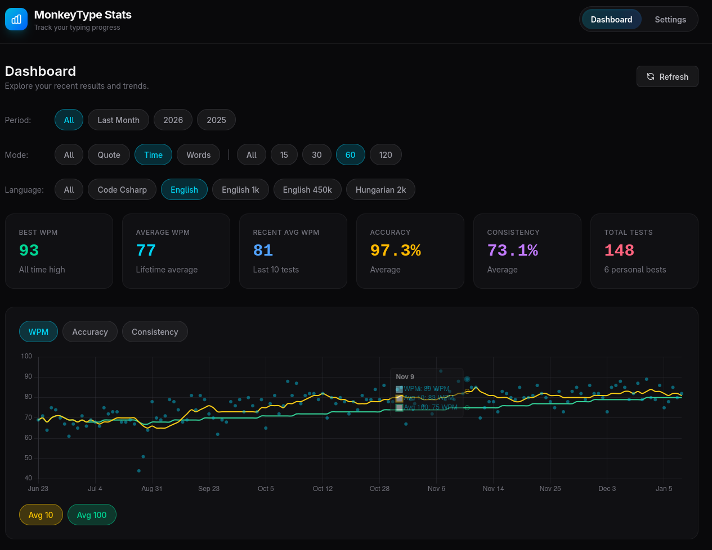
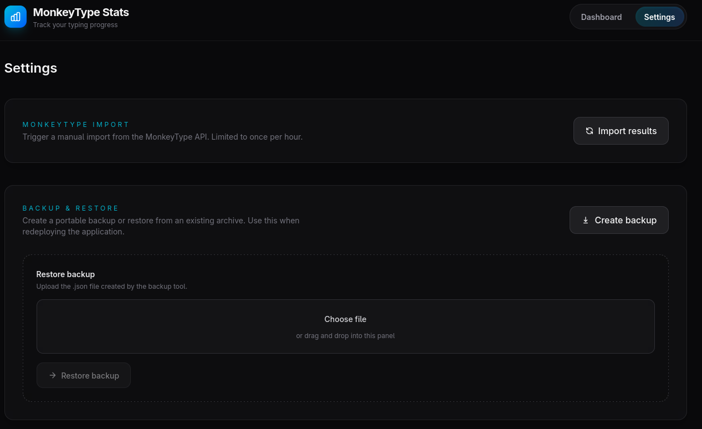

# monkeytype-stats

Unofficial MonkeyType test result exporter and dashboard.

## Why?

The built-in MonkeyType dashboard is limited to showing the latest 1000 results of a user. As far as my understanding goes, MonkeyType simply deletes any old result that falls out of this range, which makes it impossible to track long-term typing stats progress in case of active users.

The main goals of this project are:

- save my old MonkeyType results from disappearing
- enable deeper analysis of my typing stats
- learn about .NET Aspire in a fun way

## Features

- Scheduled job that runs once every day and imports all new results from the MonkeyType API with ApeKey authentication.
  - The job can also be triggered manually from the Settings page.
- Scheduled job that runs hourly and fetches missing result details (needed for wpm/burst/error charts on the test level).
- Filtering results by Timestamp, Mode (including Mode2), Language.
- Summary view showing highlights of all/filtered results.
- Table view showing the list of all/filtered results.
- Graph view showing speed/accuracy/consistency evolution over time (including rolling averages of latest 10 and 100 results).
- Graph view showing wpm/burst/error on the test level (accessible through the Details column of the table view).
- JSON backup/restore of the database

### Planned

- Activity heat-map (similar to the one on MonkeyType Account page).
- More stats calculated based on the results.
- Settings page protected with auth

## Deployment guide

1. Create and enable an ApeKey on your [MonkeyType Account settings page](https://monkeytype.com/account-settings?tab=apeKeys).
2. Use the example [docker-compose.yaml](compose/docker-compose.yaml) and [.env.example](compose/.env.example) files to deploy the application to you homelab.

Before deployment adjust the image versions in the docker-compose.yaml to use the latest images and set up the variables in the .env file.

## AI usage disclosure

The frontend was pretty much 100% vibe-coded.
I'm a backend guy with mainly .NET experience, so at the time of writing, my knowledge of React and Tailwind CSS is limited.

## Screenshots

### Dashboard

### Results Table

### Result Details

### Settings

